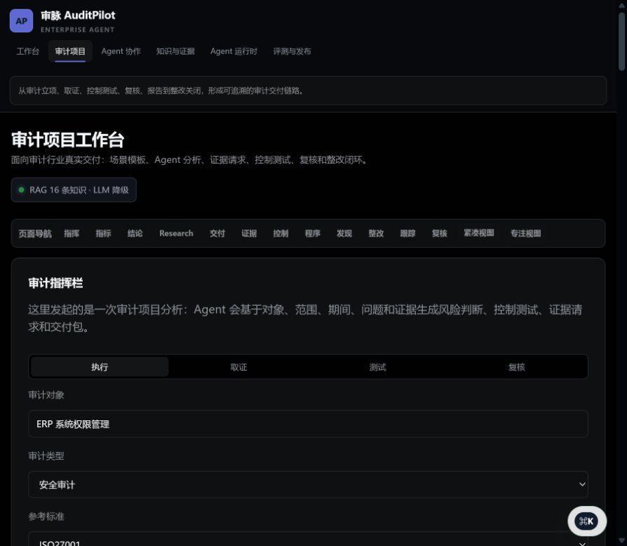
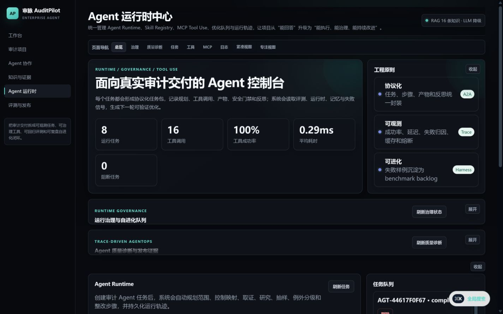
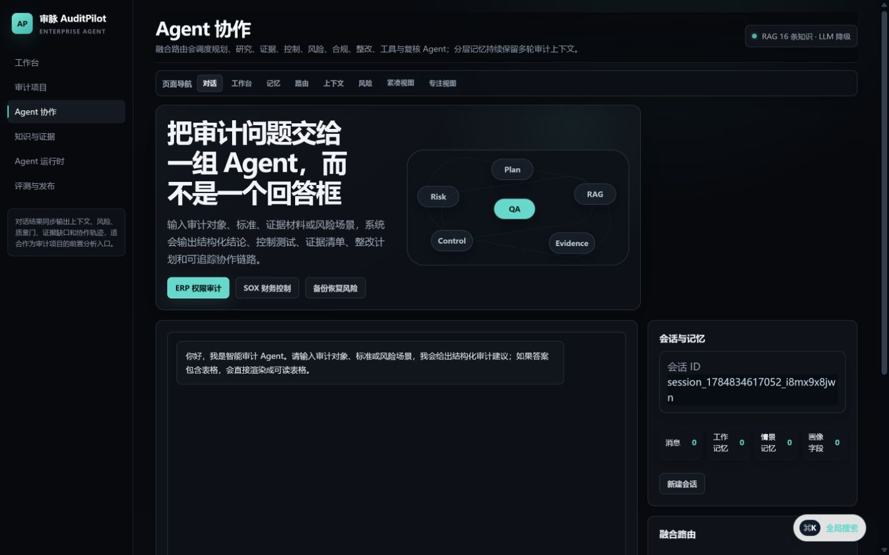
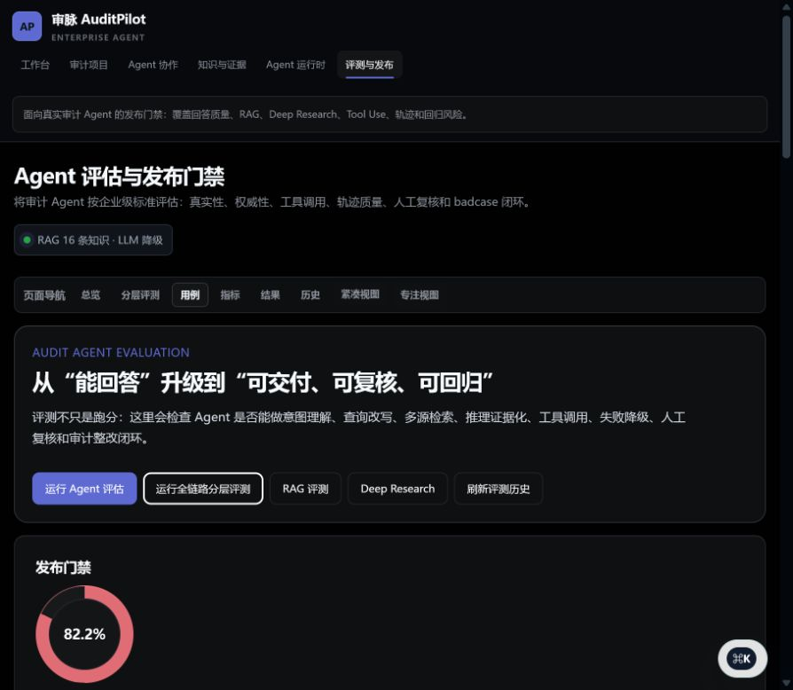
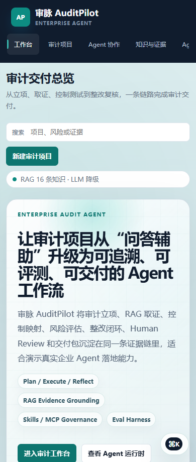

<p align="center">
  
</p>

<h1 align="center">审脉 AuditPilot</h1>

<p align="center">
  面向审计交付场景的企业级 AI Agent 工作台：把证据检索、工具执行、Harness 评测、人工复核与整改闭环放进同一条可追溯工作流。
</p>

<p align="center">
  
  
  
  
  
</p>


## Why AuditPilot

很多 Agent 项目停留在聊天框或 Demo。AuditPilot 选择一个更“硬”的落地场景：企业审计交付。它需要证据、控制、风险、复核、报告和整改闭环，也天然要求可追溯、可回归、可解释。

AuditPilot 的目标不是替代审计师，而是把审计师反复执行的取证、映射、检查、补证和交付动作，组织成一套可治理的 Agent 工作流。

## What it does

| 模块 | 能力 |
| --- | --- |
| Audit Workspace | 审计立项、控制矩阵、审计程序、抽样计划、发现、整改和交付包。 |
| Agent Runtime | 有界 Plan / Execute / Reflect 循环、按任务自适应规划、步骤依赖、结构化交接、独立交付校验、失败恢复和人工复核出口。 |
| Agentic RAG | TF-IDF + 关键词多路召回、融合重排、元数据过滤、页/章节来源、冲突证据识别和缺证提示；语义向量是可选增强。 |
| Skills / MCP-style Tools | 工具 Schema、执行前 RBAC 校验、租户隔离、TTL 缓存、熔断器、调用日志和工具指标。 |
| Memory | Working / Episodic / Profile Memory，保留多轮审计上下文。 |
| Evaluation Harness | 对任务结果、执行轨迹、工具调用、证据依据、安全权限、上下文和鲁棒性分层评测；输出校准得分与置信下界，关键断言失败直接阻断发布。 |
| Evidence Graph | 连接任务、步骤、工具运行和产物，检查来源覆盖、断裂依赖与关键孤点。 |
| Governed Improvement | 失败只沉淀为经验候选，通过回归评测和人工批准后才允许复用。 |
| Episode & Observability | 隐私友好的任务轨迹包、标准语义字段、工具证据、安全门、失败归因、干预记录和完整性摘要。 |
| Security & Storage | Bearer 身份基线、RBAC、请求限流、不可静默篡改的哈希链审计事件、上传治理，以及审计/评测记录的 SQLite WAL 事务存储。 |

## Screenshots

| Audit workspace | Agent runtime |
| --- | --- |
|  |  |

| Agent collaboration | Layered evaluation |
| --- | --- |
|  |  |

<p align="center">
  
</p>

## Architecture

```text
Audit request
  -> Hybrid Intent Router
  -> Working + Episodic + Profile Memory
  -> Planner / Evidence / Control / Risk / Compliance / Remediation / Verification / Delivery
  -> Bounded dependency-aware Agent Loop
  -> Agentic RAG + Evidence Graph + Skills / MCP-style Tools
  -> Safety Gate + Reflection + Human Review
  -> 9-layer Component Evaluation + Release Gate
  -> Delivery Package + Governed Experience Candidate
```

Design boundaries:

- LLMs help with understanding, summarization and explanation.
- Evidence gaps, quality gates, permissions, risk signals and delivery state stay auditable.
- High-risk or low-confidence outputs are routed to evidence completion and human review.

## 快速运行

要求 Python 3.10 或更高版本。项目默认支持无模型密钥运行：未配置大模型时会进入确定性回退模式，审计工作流、RAG、评测和界面仍可体验。

### Windows PowerShell

```powershell
python -m venv .venv
.\.venv\Scripts\Activate.ps1
pip install -r requirements.txt
Copy-Item config.env.example config.env
python start.py
```

### macOS / Linux

```bash
python3 -m venv .venv
source .venv/bin/activate
pip install -r requirements.txt
cp config.env.example config.env
python start.py
```

启动完成后，按终端输出的地址在浏览器中打开应用。停止服务时在终端按 `Ctrl+C`。

## 基本操作

1. 在「Agent 协作」中输入审计对象、标准或风险场景，观察多 Agent 的规划、证据、控制、风险与整改协作。
2. 在「审计项目」中建立审计范围，运行控制测试、Deep Research、证据请求和整改闭环。
3. 在「知识库」中维护可检索的审计知识；首次运行会从公开种子知识自动建立本地 RAG 存储。
4. 在「Agent 评测」中运行分层评测，查看任务、轨迹、工具、证据、安全、上下文与鲁棒性结果，以及发布门禁。
5. 在「Skills / MCP」中检查工具 Schema、权限声明、调用记录和运行状态。

## 可选配置

复制 `config.env.example` 后，只在本地 `config.env` 中填写所需配置：

| 场景 | 配置项 | 是否必需 |
| --- | --- | --- |
| LLM 增强 | `DEEPSEEK_API_KEY` 或兼容提供商变量 | 否 |
| MySQL 标准库 | `MYSQL_HOST`、`MYSQL_USER`、`MYSQL_PASSWORD` | 否 |
| Neo4j 图谱 | `NEO4J_URI`、`NEO4J_USER`、`NEO4J_PASSWORD` | 否 |
| RAG 参数 | `RAG_CHUNK_SIZE`、`RAG_CHUNK_OVERLAP`、`RAG_TOP_K` | 否 |
| 生产鉴权 | `SECURITY_MODE=enforced`、`AUDITPILOT_API_TOKENS_JSON` | 生产必需 |
| 上传治理 | `KNOWLEDGE_UPLOAD_MAX_BYTES`、`EVIDENCE_UPLOAD_MAX_BYTES`、`REJECT_PROMPT_INJECTION` | 否 |

默认安装不包含 Torch / Transformers。只有在确实需要本地语义向量时，才安装 `requirements-embeddings.txt` 并启用 `RAG_ENABLE_EMBEDDINGS=1`；默认混合检索不依赖本地大模型。

## Security

Do not commit real API keys.

- Put local secrets in `config.env`.
- Use platform secrets for deployment.
- `config.env`, `.env*`, runtime data, logs, model artifacts and local databases are ignored by Git.
- Example config files use placeholders only.
- `SECURITY_MODE=local` is intended for a single-user workstation. Any shared or network deployment must use `SECURITY_MODE=enforced` and secret-managed bearer-token configuration.
- Permissions are checked both at the HTTP boundary and immediately before a Skill handler runs; tenant IDs also scope repositories, traces, caches and memory.
- Uploads are streamed with a hard size limit, content/extension checks, hashes, credential scanning and prompt-injection quarantine.
- Liveness and dependency-aware readiness are exposed separately; readiness fails when security or persistent stores are not usable.

## Public repository scope

公开仓库只保留可运行产品代码、必要的公开种子数据、回归测试、展示截图、README 与启动配置。以下内容不会进入 Git：

- API 密钥、数据库密码和个人配置；
- 本地运行记录、会话记忆、评测结果、上传文件和生成的 RAG 存储；
- 求职 JD、面经、项目内部设计文档和完整归档；
- 本地模型、IDE 配置、日志及临时生成文件。

## Validation

```powershell
.\.venv\Scripts\python.exe -m compileall -q agents services rag web tests scripts
.\.venv\Scripts\python.exe -m pytest -q
.\.venv\Scripts\python.exe scripts\audit_repro.py
ruff check agents services rag web tests
bandit -q -ll -r agents services rag web -x tests
pip-audit -r requirements.txt
```

Current tests cover authentication/RBAC, tenant isolation, upload injection blocking, intent routing, memory compaction, Skill authorization/cache, adaptive multi-role runtime execution, delivery verification, hybrid RAG rank fusion, evidence lineage, governed experience reuse, independent-dataset evaluation semantics, repository-bound Harness gating and every visible product endpoint.

## Project layout

```text
agents/                 audit agent chain and control library
services/               runtime, memory, router, skills, safety, evaluation, delivery
rag/                    agentic RAG and local knowledge-store runtime
knowledge_graph/        optional graph construction and Neo4j adapter
training/               evaluation and offline training entry points
web/                    FastAPI application and APIs
templates/ + static/    product UI
tests/                  regression tests
docs/screenshots/       public product screenshots only
data/seed_knowledge/    public starter knowledge; runtime data is ignored
```

## Reality notes

- Runtime records, tool calls, evaluations, memory and audit cases are generated by real code and persisted locally.
- Core audit and evaluation records use transactional SQLite WAL storage; high-volume traces and memory remain file-backed in this single-node release.
- The built-in evaluation suite is a regression/smoke baseline, not proof of business accuracy. Release-grade claims require an independent held-out dataset and domain-expert review.
- The included bearer-token RBAC is a deployable baseline, not a replacement for enterprise OIDC/SSO, external KMS, object storage or a multi-node database.
- Role collaboration is an observable, contract-bound orchestration inside one runtime process; it is not presented as a fleet of independently deployed autonomous services.
- Untested throughput, accuracy or availability claims are intentionally not presented as project facts.
- SFT / RLHF-style model training is treated as an offline extension; the Web app focuses on workflow, evaluation and data preparation.
