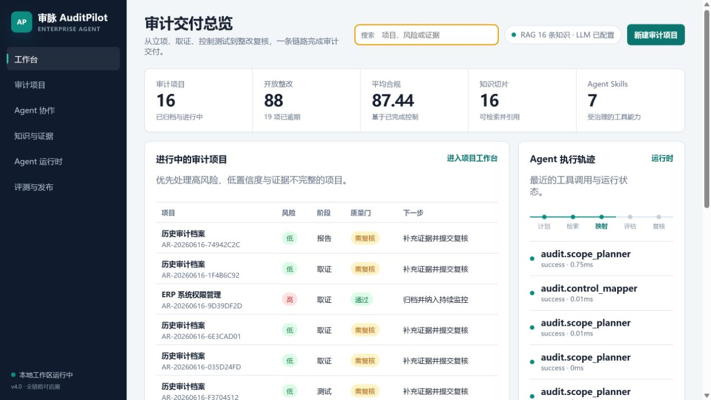

# 审脉 AuditPilot

面向真实审计交付的企业级 AI Agent 工作台。系统把审计立项、知识检索、证据分析、控制测试、风险评估、审计发现、整改跟踪、人工复核和最终交付放在一条可追溯链路上，并提供可治理的 Agent Runtime、Skills/MCP 工具、分层记忆、评测回归和发布门禁。

> 当前版本：v4.0。默认具备无外部服务降级能力；配置兼容 OpenAI 协议的模型后，可启用 LLM 增强分析。



## 核心能力

- 审计交付闭环：范围、控制矩阵、审计程序、抽样计划、证据请求、发现、整改、复核和交付包。
- Hybrid Agent 路由：Pattern + 本地 n-gram 语义相似度融合，输出意图、置信度、实体与多 Agent 协作决策。
- 三层会话记忆：持久化工作记忆、压缩后的情景记忆、审计画像；服务重启后仍可读取。
- Agent Runtime：协议化任务、依赖计划、逐步执行、重试、反思、产物、检查点与观测指标。
- Skills / MCP：输入 Schema、权限声明、超时、TTL 缓存、熔断、调用日志和指标。
- Agentic RAG：持久化知识库、切块、混合检索、查询扩展、来源引用、证据化回答和降级检索。
- 评测与发布：Agent/RAG/Research 评测、轨迹质量、人工复核意识、基线差异、回归检测与发布门禁。
- 生产工程：FastAPI、Docker、健康检查、CORS、文件持久化、可选 MySQL/Neo4j、云平台配置。

## 快速启动

```powershell
python -m venv .venv
.\.venv\Scripts\Activate.ps1
pip install -r requirements.txt
Copy-Item config.env.example config.env
python start.py
```

访问：

- 产品工作台：<http://127.0.0.1:8000>
- OpenAPI：<http://127.0.0.1:8000/docs>
- 健康检查：<http://127.0.0.1:8000/api/health>

不配置模型密钥时，审计、RAG、控制映射、证据分析、运行时与评测仍可使用确定性降级链路。真实密钥只放在 `config.env`，该文件已被 Git 忽略。

## 产品页面

| 页面 | 用途 |
| --- | --- |
| `/` | 审计项目、控制健康、证据队列、Agent 轨迹和交付就绪度 |
| `/audit` | 从立项到整改关闭的完整审计项目工作台 |
| `/chat` | 融合意图路由、多 Agent 协作与持久化会话记忆 |
| `/knowledge` | 知识写入、文件切块、RAG 检索和来源验证 |
| `/skills` | Agent Runtime、Skills、MCP、工具治理、安全门禁和反思 |
| `/training` | Agent/RAG/Research 评测、基线回归与发布门禁 |

## 架构

```text
用户 / 审计项目
  -> Hybrid Intent Router
  -> Working + Episodic + Profile Memory
  -> Planner / Evidence / Control / Risk / Compliance / Remediation Agents
  -> Agentic RAG + Knowledge Graph + Skills/MCP Tools
  -> Safety Gate + Reflection + Human Review
  -> Audit Repository + Evaluation Baseline + Delivery Package
```

系统坚持两条边界：

1. 模型负责理解、归纳和解释；风险评分、证据缺口、权限、安全门禁与交付状态保留可审计的确定性逻辑。
2. Agent 不替代审计师作最终专业判断；证据不足、高风险或低置信度会进入补证和人工复核。

## 测试

```powershell
.\.venv\Scripts\python.exe -m compileall -q agents services rag web tests
.\.venv\Scripts\python.exe -m unittest discover -s tests -v
```

当前自动化测试覆盖融合路由、记忆压缩与画像、Skill 输入治理与缓存、运行时反思、评测基线回归。交互验收覆盖桌面/移动端、总览筛选、Agent 对话、运行时任务和控制台错误检查。

## 文档

- [架构与设计](docs/01-项目架构与设计.md)
- [完整使用与演示指南](docs/02-完整使用与演示指南.md)
- [Agent 核心能力详解](docs/03-Agent核心能力详解.md)
- [API 与数据模型](docs/04-API与数据模型.md)
- [JD 对齐与简历面试指南](docs/05-JD对齐与简历面试指南.md)
- [测试、部署与生产化清单](docs/06-测试部署与生产化清单.md)
- [升级变更记录](docs/07-升级变更记录.md)
- [部署说明](DEPLOYMENT.md)

## 项目结构

```text
agents/                 审计 Agent 主链与控制库
services/               Runtime、Memory、Router、Skills、安全、评测、交付
rag/                    Agentic RAG 与持久化知识库
knowledge_graph/        图谱构建与 Neo4j 可选接入
training/               Agent 评测与离线训练入口
web/                    FastAPI 应用与 API
templates/ + static/    产品界面
tests/                  自动化回归测试
docs/                   项目归档文档源
data/                   本地运行数据（大部分已 Git 忽略）
```

## 真实性说明

- 项目中展示的运行记录、工具调用、评测、记忆和审计档案均由真实代码生成并持久化，不是静态截图。
- 未经压测验证的吞吐、准确率或可用性不作为项目事实；简历量化应使用实际评测结果。
- SFT/RLHF 类重训练被明确放在离线任务中，Web 进程只提供评测和数据准备入口。
